<div align="center">
  <h1>🎵 Song Play App</h1>
  <p>A full-stack MERN music streaming platform for listeners and creators.</p>
  <p>
    
    
    
    
    
    
    
    
    
    
  </p>
</div>

<div align="center">
  
  <p><em>Supply screenshots for each page inside <code>img/</code> folder in the root layout using the names listed below.</em></p>
</div>

---

## 📋 Table of Contents

- [Overview](#overview)
- [Key Highlights](#key-highlights)
- [Architecture](#architecture)
- [Feature Tour](#feature-tour)
- [Frontend Screens & Workflows](#-frontend-screens--workflows)
- [Artist & Song Workflow](#artist--song-workflow)
- [Tech Stack](#tech-stack)
- [Getting Started](#getting-started)
- [Environment Variables](#environment-variables)
- [Routes & API Glimpse](#routes--api-glimpse)
- [Future Roadmap](#future-roadmap)

---

## Overview

Song Play App is a solo-built MERN experience that focuses on functionality: uploading audio, organizing artists/albums, streaming music with a global player, and giving artists full control over their catalog. It ships with a protected React frontend and a RESTful Node/Express backend backed by MongoDB and Cloudinary storage.

### 🔍 Important Callouts

- You must be logged in to access every page except `/login`.
- Becoming an artist is mandatory before the Add Song flow unlocks.
- Every genre card on `/genre` opens the full catalog for that music category.
- Library lets you create albums, drill into any album, and play all songs from that album page.
- Settings centralizes edit profile, logout, and device/session management.
- The Not Found page is customized, so even invalid URLs keep users inside the brand experience.

---

## Key Highlights

- 🔐 **Auth-first** – JWT + Passport-secured APIs, `PrivateRoute` protection, and automatic redirects for logged-in users.
- 🎧 **Global Playback** – `GlobalAudioPlayer` keeps music running even when switching routes; queue state lives in Redux.
- 🎨 **Genre Discovery** – Visual genre cards/icons plus search to drill into niche sounds instantly.
- 📚 **Powerful Library** – Create albums, play them, manage songs, and drill into album detail pages.
- 🧑‍🎤 **Artist Mode** – Create an artist account, upload songs, manage releases, and control visibility (public/private).
- 🔔 **Notifications & Settings** – Dedicated pages for updates, profile edit, device logout, theme, and more.
- 🧭 **Full Navigation** – Home, Genre, Library, Search, Liked, Profile, Add Song, Artist, Notifications, Settings, and 404 routes.
- 📱 **Responsive Layout** – Custom sidebar/header combos for desktop and mobile.

---

## Architecture

```
song-play-app/
├── img/               # Screenshots for README 
├── Backend/           # Express, Mongoose, Passport, Cloudinary services
│   ├── src/
│   │   ├── routes/    # auth, artist, album, song, user, notification APIs
│   │   ├── controllers/
│   │   ├── services/  # songAdd, album, artist, cloudinary uploads
│   │   └── Models/    # user, artist, album, song schemas
│   └── package.json
└── Frontend/          # React + TS + Vite client
    ├── src/
    │   ├── pages/     # Home, Genre, Library, Profile, etc.
    │   ├── components/
    │   ├── features/  # Redux slices (user, song/player, library)
    │   ├── api/       # Axios helpers
    │   └── routes/    # AppRoutes.tsx
    └── package.json
```

- **State Flow**: Redux Toolkit stores user/session/audio state. `fetchUser` hydrates the store on app load.
- **Media Flow**: Files upload to Cloudinary via backend services, returning URLs consumed by the frontend.
- **Security**: `PrivateRoute` wraps every in-app page; backend uses JWT middleware plus ownership checks on mutations.

---

## Feature Tour

| Page | Route | Highlights | Screenshot |
| ---- | ----- | ---------- | ---------- |
| Home | `/` | Trending songs, quick actions, featured artists | `home-page.png` |
| Genre | `/genre` | Search, genre icons, filter by mood/style | `genre-page.png` |
| Library | `/library` | My albums, create album, album cards, album detail at `/library/album/:slugAndId` | `library-page.png` |
| Profile | `/Profile` | View/manage songs & albums, stats, quick link to add songs | `profile-page.png` |
| Add Song | `/Profile/addSongs` | **Artist-only** form with audio/image uploads, metadata, visibility controls | `add-song-page.png` |
| Settings | `/settings/*` | Edit profile, manage songs/albums/artists, theme, notifications, logout devices, delete account | `settings-page.png` |
| Notifications | `/notification` | All app notifications, read/unread states | `notifications-page.png` |
| Artist | `/artist/:slugAndId` | Public artist profile, albums, songs | `artist-page.png` |
| Search | `/search/:slug` | Global search with live results, quick actions | `search-page.png` |
| Liked Songs | `/liked` | Saved favorites playlist with play/unlike | `liked-songs-page.png` |
| Login | `/login` | Public auth page; redirects when already logged in | `login-page.png` |
| 404 | `*` | Branded not-found with navigation fallback | `not-found-page.png` |

---

## 🖼️ Frontend Screens & Workflows

All screenshots referenced below should be placed in `img/` folder in the root layout using the filenames listed in the Feature Tour table. They will automatically render in this README once added.

### 🏠 Home Page (`/`)

<div align="center">
  
</div>

- Landing view after authentication with trending songs, recent releases, and featured artists.
- Quick actions for resuming playback, jumping to genres, and opening the library.
- Global audio player stays pinned so playback keeps running.

### 🎸 Genre Page (`/genre`)

<div align="center">
  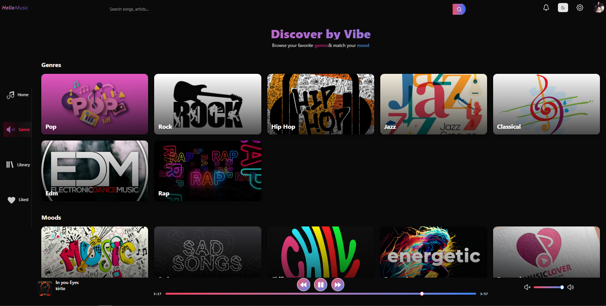
</div>

- Search bar lets users filter genres or specific songs instantly.
- Icon-based genre cards highlight moods/styles; clicking one loads every track in that genre.
- Genre results can be played immediately or added to the queue.

### 📚 Library Page (`/library`)

<div align="center">
  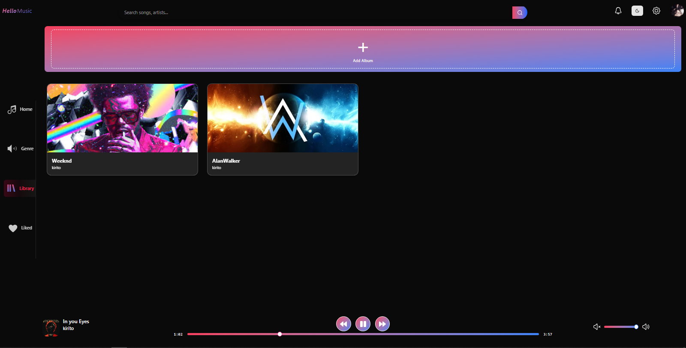
</div>

- Displays every album the user owns, plus a CTA to create new albums.
- Album cards include cover art, song counts, and quick-play actions.
- Clicking an album (`/library/album/:slugAndId`) opens its detail view with the full track list, metadata, and play controls.
- Use the "Create Album" action to group songs you plan to release later.

### 👤 Profile Page (`/Profile`)

<div align="center">
  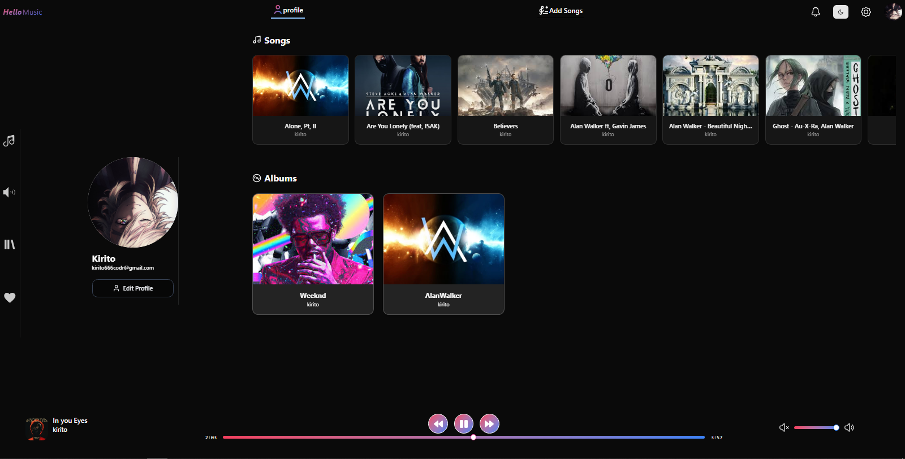
</div>

- Summarizes the listener/artist profile, including stats, uploaded songs, and albums.
- Nested routes render profile data and the add-song workflow in the same shell.
- Central hub for keeping track of owned content and navigating to management tools.

### ➕ Add Song Page (`/Profile/addSongs`)

<div align="center">
  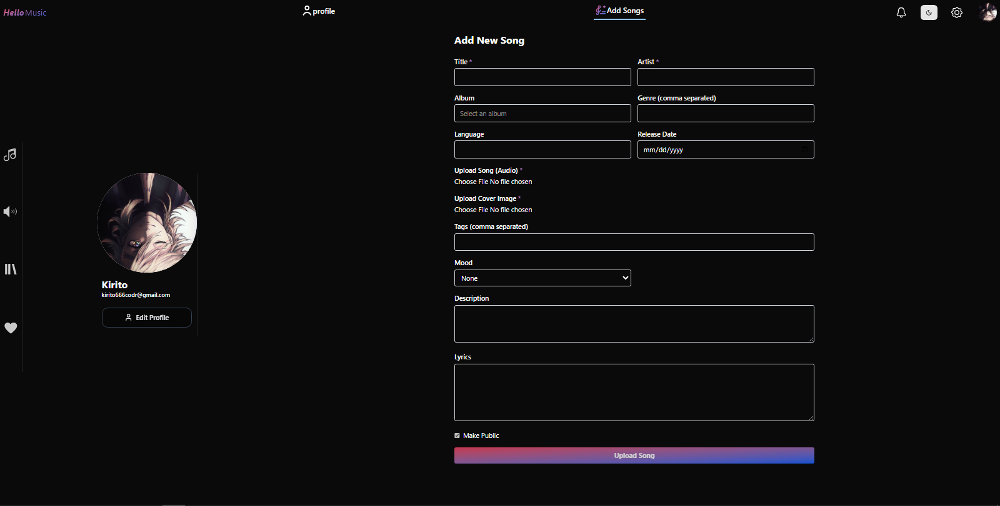
</div>

- **Requires an artist account**—users are redirected to create one if they are not yet an artist.
- Full form with title, duration, artist selector, album picker/creator, genre tags, mood, language, lyrics, description, release date, and cover/audio uploads.
- Visibility controls allow making songs public or private before publishing.
- Input checklist:
  - Basic info: title, description, tags, mood, release date
  - Music files: audio upload (e.g., `.mp3`, `.wav`) + cover artwork
  - Relationships: choose/create artist, choose/create album, set genres & language
  - Options: lyrics, visibility/public toggle, custom metadata like duration
- After submission, the track is stored, linked to the album, and instantly playable from Library and Artist pages.

### ⚙️ Settings (`/settings/*`)

<div align="center">
  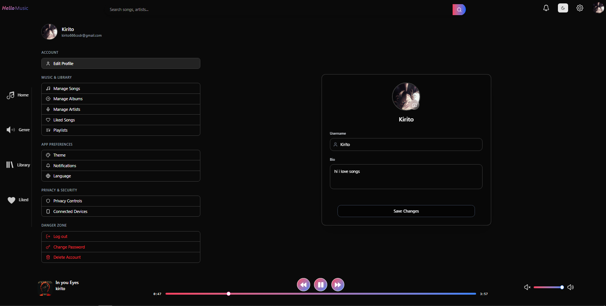
</div>

- Multi-section dashboard for editing profile info, changing passwords, managing content, and handling account security.
- Includes routes such as:
  - `editProfile`
  - `manageSongs`
  - `manageAlbums`
  - `manageArtists`
  - `notifications`
  - `connectedDevices`
  - `logoutDevices`
  - `changePassword`
  - `deleteAccount`
- Theme and language preferences also live here.

### 🔔 Notifications (`/notification`)

<div align="center">
  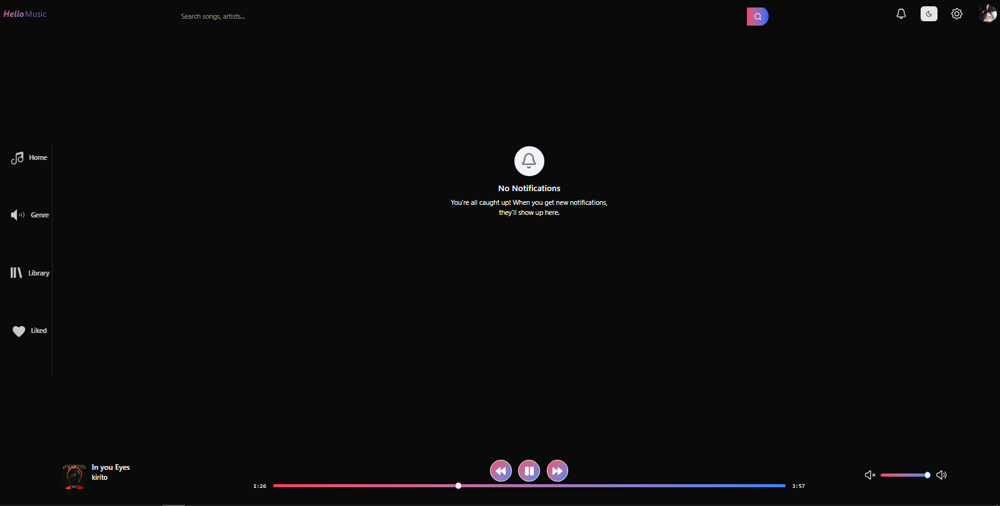
</div>

- Timeline of system/app notifications, including likes, follows, releases, and system alerts.
- Supports marking notifications as read and provides quick navigation to related content.
- Ideal for keeping tabs on new album drops, playlist additions, and profile activity.

### 🎤 Artist Page (`/artist/:slugAndId`)

<div align="center">
  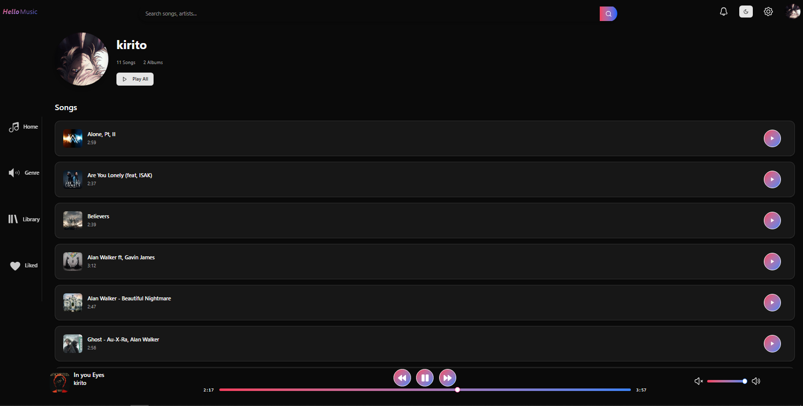
</div>

- Public-facing artist profile with photo, bio, genres, and location.
- Lists all public albums and songs so other listeners can explore discographies.
- Ideal for showcasing other artists by slug/id, including follow and play options.
- If a song/album is private, it stays hidden—only the artist sees it inside Profile/Library.

### 🔍 Search Page (`/search/:slug`)

<div align="center">
  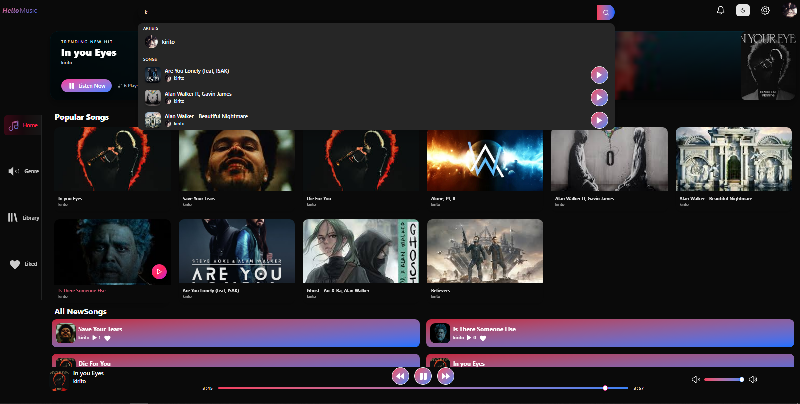
</div>

- Global search surface spanning songs, albums, and artists.
- Live results while typing, with quick buttons to play, like, or open detail pages.
- Helpful for jumping directly to any resource in the catalog.

### ❤️ Liked Songs (`/liked`)

<div align="center">
  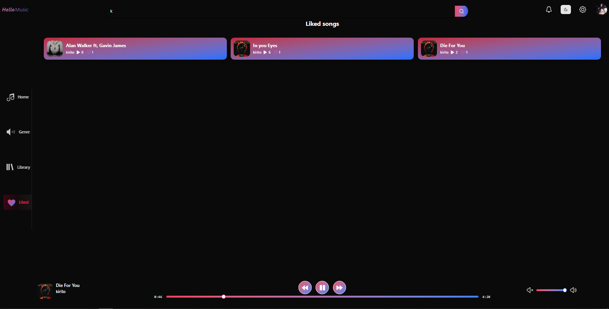
</div>

- Aggregated playlist of every song a user has liked.
- Offers Play All, shuffle, and unlike actions without leaving the page.
- Great for quickly resuming favorite tracks.

### 🔐 Login (`/login`)

<div align="center">
  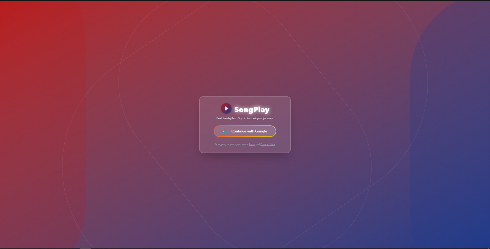
</div>

- Public route guarded by `PublicRoute`; authenticated users are redirected to `/`.
- Accepts credentials, talks to the backend auth endpoints, and stores tokens in Redux/localStorage.

### 🚫 Not Found (`*`)

<div align="center">
  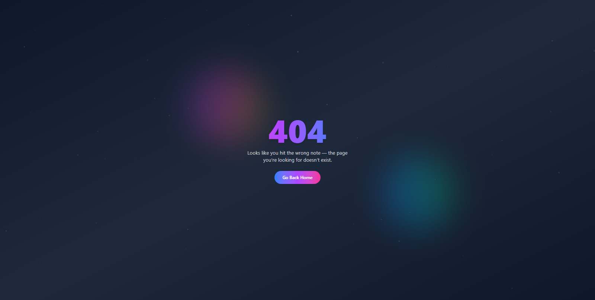
</div>

- Branded 404 page guiding users back to safe routes or search.
- Confirms that navigation is intentionally handled for invalid URLs.
- Includes quick links back to Home, Library, and Search so the session doesn't stall.

---

## Artist & Song Workflow

1. **Create Artist Account**  
   - Required before accessing Add Song page.  
   - Uses `CreateArtistService` → `ArtistModel`.  
   - Stores name, bio, genres, photo, location.  

2. **Upload Audio**  
   - Add Song form posts audio + cover image.  
   - Backend uploads via `audioUpload` / `imageUpload` helpers (Cloudinary).  

3. **Save Song Metadata**  
   - `AddSong` service validates artist/album IDs, stores genres, moods, lyrics, visibility flags, etc.  
   - `AddsongInAlbum` attaches track to album document.  

4. **Manage Catalog**  
   - Library and Profile pages list songs/albums with edit/delete actions.  
   - Settings subpages offer advanced management (manage songs/albums/artists).  

5. **Public Sharing**  
   - Artist page (`/artist/:slugAndId`) shows only public tracks/albums.  
   - Listeners can follow, like, and play content from anywhere in the app.  

---

## Tech Stack

- **Frontend**: React 18, TypeScript, Vite, Redux Toolkit, React Router, Tailwind CSS, React Hook Form, Zod.
- **Backend**: Node.js, Express, Mongoose, Passport JWT, Multer, Cloudinary SDK.
- **Storage/CDN**: MongoDB Atlas (data), Cloudinary (audio/images), optional local fallbacks in `public/`.
- **Tooling**: ESLint, Prettier, pnpm/npm scripts, Vite dev server with HMR.

---

## Getting Started

```bash
# Clone and install
git clone <repo-url>
cd song-play-app

# Backend setup
cd Backend
npm install
npm run dev        # expects MongoDB + JWT env vars

# Frontend setup (new terminal)
cd ../Frontend
npm install
npm run dev        # starts Vite on http://localhost:5173
```

### Production Builds

```bash
# Backend
cd Backend
npm run build      # if you bundle with swc/tsc
npm run start

# Frontend
cd Frontend
npm run build
npm run preview    # or serve dist/ via any static host
```

---

## Environment Variables

```
# Backend/.env
MONGODB_URI=
JWT_SECRET=
CLOUDINARY_CLOUD_NAME=
CLOUDINARY_API_KEY=
CLOUDINARY_API_SECRET=

# Frontend/.env
VITE_API_BASE_URL=http://localhost:5000/api
```

Set additional variables for OAuth providers, rate-limiter configs, and feature flags as needed.

---

## Routes & API Glimpse

### Frontend Routing (`src/routes/AppRoutes.tsx`)

- Public: `/login`
- Private: `/`, `/genre`, `/library`, `/library/album/:slugAndId`, `/liked`, `/Profile`, `/Profile/addSongs`, `/search/:slug`, `/settings/*`, `/notification`, `/artist/:slugAndId`
- Catch-all: `*` → `NotFoundPage`

### Backend Highlights

- `auth.route.js` – login, refresh, logout
- `song.route.js` – add song, like/unlike, recent, popular, genre filtering
- `artist.route.js` – search artist, create artist, fetch artist by slug/id
- `album.route.js` – create album, get albums, attach songs
- `notification.route.js` – user notifications

Each route layers auth middleware, validation, and service calls (see `Backend/src/services`).

---


## Future Roadmap

- [ ] Playlist editor & sharing
- [ ] Collaborative queue / party mode
- [ ] Real-time lyrics & synced captions
- [ ] Rich notifications (push/websocket)
- [ ] Advanced search filters + sorting
- [ ] Offline caching / PWA mode
- [ ] Mobile/native clients

---

## Contributing

1. Fork the repo and create a feature branch.  
2. Document environment assumptions in your PR.  
3. Run linters/tests before opening the request.  
4. Describe the change clearly (UI, API, data migrations, etc.).  

Bug reports, UI polish, and accessibility improvements are especially welcome!

---

Built solo for learning, shipping, and sharing music. 🎶